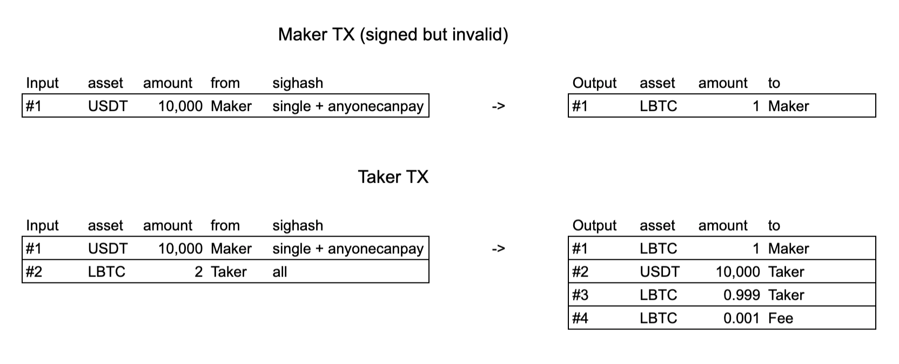
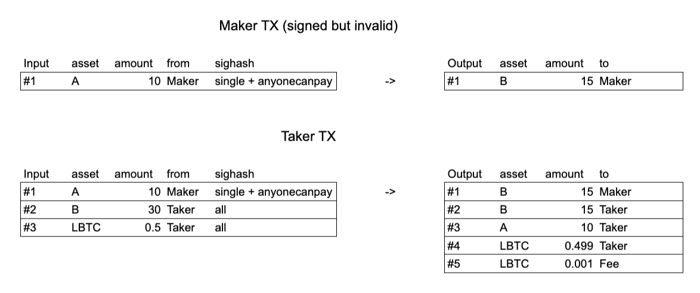

# LiquiDEX

**WARNING**: This is experimental software, do not use with real funds.

A decentralized exchange for Liquid transactions.

## Naming

- **Maker**: proposes the trade as a signed but partial transaction
- **Taker**: accepts the trade, completes and broadcasts the transaction

## Flow

NOTE: for now assume all maker's inputs and outputs are unblinded.

Maker wants to propose to exchange amount `x` of asset `A` for amount `y` of
asset `B`.

Maker must have an utxo `U_xA` locking exactly amount `x` of asset `A`.

Maker creates a transaction `T_xAyB` spending a single utxo `U_xA` and receiving
a single output locking amount `y` of asset `B`. At this stage `T_xAyB` is
partial and invalid.

Maker signs the (only) input with `SIGHASH_SINGLE | SIHASH_ANYONECANPAY`.
This allows the Taker to add more inputs and outputs, without invalidating the
Maker signature.

Maker posts `TX_xAyB` to the __LiquiDEX__.

Taker sees `TX_xAyB` on the __LiquiDEX__, and decides to accept the trade.

Taker does _whatever it wants_ to complete the trade, what follow is an example.

Taker does some verifications, such as `U_xA` actually locks amount `x` of
asset `A`.

Taker adds an output locking amount `x` of asset `A`.

Taker funds `TX_xAyB` (fee and asset `A`).

Taker signs the newly added transacion inputs, possibly with `SIGHASH_ALL`.

Taker broadcasts the `TX_xAyB`, and the trade is executed.

### Examples

#### 10000 USDT in exchange of 1 LBTC



#### 10 asset A in exchange of 15 asset B 



## Test on Liquid Mainnet

In the following example performed on Liquid Mainnet, the Maker propose a trade
offering 4.99 USDT in exchange of 0.05 Atomic Swap pints. 

### Requirements

`python3` with `requests` and `wallycore>=0.7.9` modules installed 

### Maker
```
$ python3 maker-cli.py -n http://USER:PSW@IP:PORT/ -u 6a9956e9d97a8478fd5269224aa41b8365ff4efb32b4f7bfe3db0b80b1f7d94d:1 -a 13315b14d240bde1e797d8396cd58f1e9fe9d0f459298a9c35a8fa44ba87462e -r 0.0000000100195
0200000001014dd9f7b1800bdbe3bff7b432fb4eff65831ba44a226952fd78847ad9e956996a010000001716001427a846c3321d8b53363366e403d32dab5e4f67d0ffffffff01012e4687ba44faa8359c8a2959f4d0e99f1e8fd56c39d897e7e1bd40d2145b31130100000000000000050017a914e6db86e6f1c907a36a8cf710b67ccda655fbae45870000000000000247304402200556f815e569545a1c610b4a027caeac428a938159d862bd678aea4bf81be86c022078f0c249638b174f5bea4fb1dd4b03184743066791b145c778578bca6b1278cf8321025c8b0c545a78c130c5db81460a39614c5cd081cbe521953788cb2291c111c207000000
```

### Taker

```
$ python3 taker-cli.py -n http://USER:PSW@IP:PORT/ -t 0200000001014dd9f7b1800bdbe3bff7b432fb4eff65831ba44a226952fd78847ad9e956996a010000001716001427a846c3321d8b53363366e403d32dab5e4f67d0ffffffff01012e4687ba44faa8359c8a2959f4d0e99f1e8fd56c39d897e7e1bd40d2145b31130100000000000000050017a914e6db86e6f1c907a36a8cf710b67ccda655fbae45870000000000000247304402200556f815e569545a1c610b4a027caeac428a938159d862bd678aea4bf81be86c022078f0c249638b174f5bea4fb1dd4b03184743066791b145c778578bca6b1278cf8321025c8b0c545a78c130c5db81460a39614c5cd081cbe521953788cb2291c111c207000000
0200000001034dd9f7b1800bdbe3bff7b432fb4eff65831ba44a226952fd78847ad9e956996a010000001716001427a846c3321d8b53363366e403d32dab5e4f67d0ffffffff76f33a48508a798f3e33916b4d35ab993e7d0894b8c85a63c9b0acd4d4a6767f02000000171600141bd2faabe63cb83d0132adc0b5bab6bb3555227dffffffff76f33a48508a798f3e33916b4d35ab993e7d0894b8c85a63c9b0acd4d4a6767f00000000171600149beeebb6daa82d4b44f60a0427902b6c719f7cb7ffffffff04012e4687ba44faa8359c8a2959f4d0e99f1e8fd56c39d897e7e1bd40d2145b31130100000000000000050017a914e6db86e6f1c907a36a8cf710b67ccda655fbae458701d27ba36598fa8f2502aefffc9c3d76f16037ba1323631ab78bc7838b991c09ce01000000001dbe8bd20017a914bb69bd5c18a00d8d5a55731ee295a73b8949c71b87016d521c38ec1ea15734ae22b7c46064412829c0d0579f0a713d1c04ede979026f0100000000000074fa0017a9147396e744de6d241ea0b88ad5338f4b25d62b2c5c87016d521c38ec1ea15734ae22b7c46064412829c0d0579f0a713d1c04ede979026f01000000000000003600000000000000000247304402200556f815e569545a1c610b4a027caeac428a938159d862bd678aea4bf81be86c022078f0c249638b174f5bea4fb1dd4b03184743066791b145c778578bca6b1278cf8321025c8b0c545a78c130c5db81460a39614c5cd081cbe521953788cb2291c111c2070000000247304402204707fe6fc2c63b127befcf464c7c1733ba6fb89214cb1ab7a32e40e65e17a6470220759b2dc88d11ff64919fdf1afa384c4ccef7d35b5cd930722e7957afeff867580121035bd046c871ced49f3eac39ec8df8881c75237439ef5b0e8cb0e598c5953a4df600000002473044022017c364f04ba365b9b6e80cd8b1c3461966d317b477b07ec19f92bbe4f23bcc08022023f9960df2f93b3991cc83a2f1b6d01a716430ca4fb931f50b6a63f2ed14e5a70121023ab10f5c287e62d03d0daa32c358e14d9ff6b96b8356346bcd9077bbd6c3bd27000000000000000000
```

### Result

[13315b14d240bde1e797d8396cd58f1e9fe9d0f459298a9c35a8fa44ba87462e](https://blockstream.info/liquid/tx/956fd783864fa4d48a9b85af2336140073651238a76d4cd59d08875cbc4e09ec)

## Considerations

[Existing protocol](https://github.com/Blockstream/liquid-swap/) is done in 3 steps while LiquiDEX use only 2 steps.
Moreover, contrary to liquid-swap, LiquiDEX it's not interactive, meaning that the Maker does not have to be online when the trade executes.
In LiquiDEX creating a trade proposal does not require an onchain tx, however, removing the proposal requires that the maker makes a tx, 
spending the input proposed as a trade and invalidating the proposal. 

## Possible improvements:

- Handle L-BTC as a trading asset.
- Rather than requiring all maker inputs and outputs to be unblinded, only
  require that its inputs are unblinded. This requires that the maker includes
  some extra information, so that the taker can blind the whole transaction.
- All maker inputs and outputs can be blinded. This requires that the maker 
  include extra information, so that the taker can unblind the maker's inputs
  and outputs.
- Taker could potentially take multiple maker proposed transactions and complete
  those in a single tx

## Copyright

[MIT](LICENSE)
